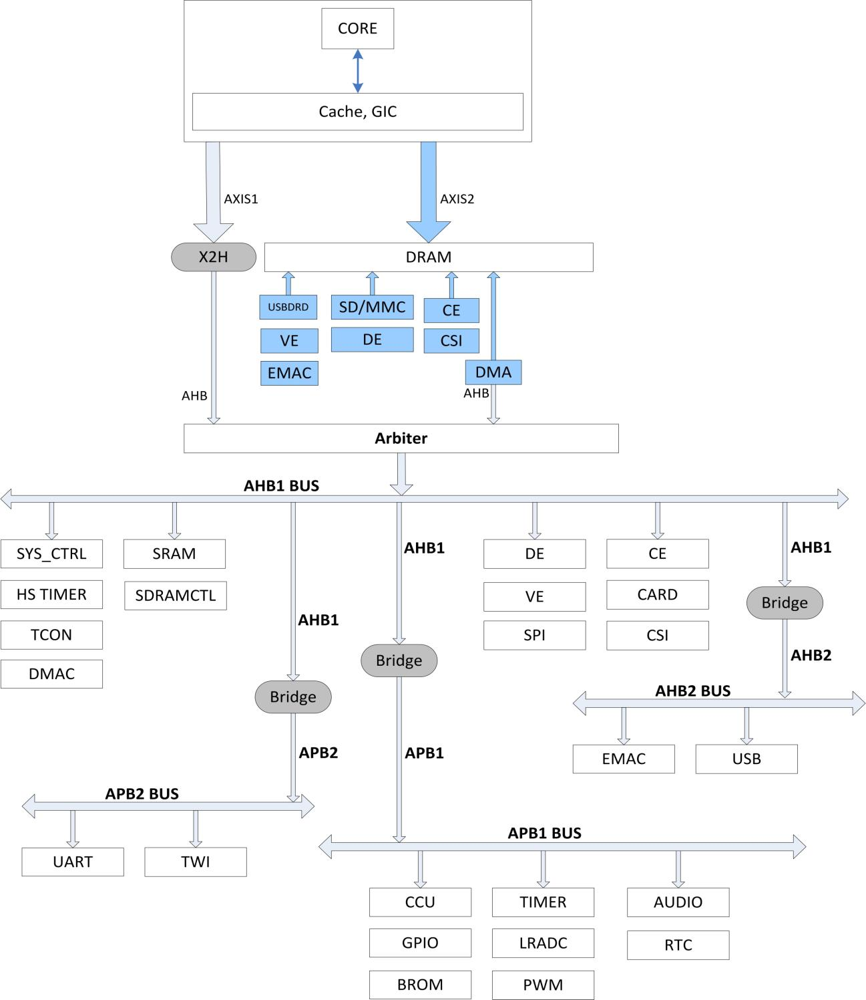

# Bootflow

## 0. 背景

V3S的datasheet里有这样一幅图：


这张图实际上描述了V3S的bootrom的大体工作流程，那么，我们应该如何使用该流程来启动我们的代码甚至Linux呢？更近一步的话，我们是否能对bootrom进行更详细的分析呢？

本文参考资料：

> [https://doc.funkey-project.com/developer_guide/software_reference/boot_process/boot_rom/](https://doc.funkey-project.com/developer_guide/software_reference/boot_process/boot_rom/)

## 1. bootrom存储位置与导出

根据datasheet的memory map可知，bootrom在v3s中位于如下地址段：


所幸的是，这段地址没有做读保护，我们可以用xfel或者sunxi-fel直接读出bin。

本文不涉及反编译的过程，感兴趣的同学可以自行研究，这里直接给出反编译后的汇编代码：

[brom.s](https://github.com/FunKey-Project/Allwinner-V3s-BROM/blob/main/brom.s)

brom的开头，就是中断向量表，这里对ARM的中断向量表和复位机制不多赘述：

```
	;; Vector table
ffff0000:	ea000008 	b	reset	      ; reset
ffff0004:	ea000006 	b	unimplemented ; _undefined_instruction
ffff0008:	ea000005 	b	unimplemented ; _software_interrupt
ffff000c:	ea000004 	b	unimplemented ; _prefetch_abort
ffff0010:	ea000003 	b	unimplemented ; _data_abort
ffff0014:	ea000002 	b	unimplemented ; _not_used
ffff0018:	ea000011 	b	irq	      ; _irq
ffff001c:	ea000000 	b	unimplemented ; _fiq
ffff0020:	ea000013 	b	fel_setup     ; FEL

unimplemented:
ffff0024:	eafffffe 	b	unimplemented ; loop forever
```

## 2. Reset Function

```
reset:
ffff0028:	e3a00001 	mov	r0, #1
ffff002c:	e3a01000 	mov	r1, #0
ffff0030:	e3a02000 	mov	r2, #0
ffff0034:	e3a03000 	mov	r3, #0
ffff0038:	e3a04000 	mov	r4, #0
ffff003c:	e3a05000 	mov	r5, #0
ffff0040:	e3a06000 	mov	r6, #0
ffff0044:	e3a07000 	mov	r7, #0
ffff0048:	e3a08000 	mov	r8, #0
ffff004c:	e3a09000 	mov	r9, #0
ffff0050:	e3a0a000 	mov	sl, #0
ffff0054:	e3a0b000 	mov	fp, #0
ffff0058:	e3a0c000 	mov	ip, #0
ffff005c:	e3a0d000 	mov	sp, #0
ffff0060:	e59ff100 	ldr	pc, [pc, #256]	; 0xffff0168 =0xffff2c00 jump to BROM
```

机器复位后，清各个寄存器，然后进行一次跳转，跳转后的内容，是allwinner系列MPU的BOOT HEADER：

```
BROM:

	;; BROM header
ffff2c00:	ea000006 	b	start  		; jump instruction, see below
ffff2c04:	4e4f4765	.ascii	"eGON" 		; magic
ffff2c08:	4d52422e	.ascii	".BRM"
ffff2c0c:	00000020	.word	32 		; header length
ffff2c10:	30303131	.ascii	"1100"		; boot version (1.1.00)
ffff2c14:	30303131	.ascii	"1100"		; eGon version (1.1.00)
ffff2c18:	31383631	.ascii	"1681"		; platform information (V3s)
ffff2c1c:	00000000	.word	0
```

### 关于BOOT HEADER中的jump instruction

jump_instruction字段存放的是一条跳转指令：( b start )，此跳转指令被执行后，程序将跳转到Boot_file_head后面第一条指令。

ARM指令中的B指令编码如下：

+--------+---------+------------------------------+

| 31--28  | 27--24   |            23--0			     |

+--------+---------+------------------------------+

|  cond    | 1 0 1 0   |      signed_immed_24          |

+--------+---------+------------------------------+

《ARM Architecture Reference Manual》对于此指令有如下解释：

Syntax :

B{`<cond>`} `<target_address>`

`<cond>` Is the condition under which the instruction is executed. If the  `<cond>` is omitted, the AL(always, its code is 0b1110 )is used

`<target_address>` Specified the address to branch to. The branch target address is calculated by:

1. Sign-extending the 24-bit signed (wro's complement) immediate to 32 bits.
2. Shifting the result left two bits.
3. Adding to the contents of the PC, which contains the address of the branch instruction plus 8.

由此可知，此指令编码的最高8位为：0b11101010，低24位根据BOOT HREADER的大小动态生成，所以指令的组装过程如下：

( sizeof( boot_file_head_t ) + sizeof( int ) - 1 ) / sizeof( int ) 		求出文件头占用的“字”的个数

-2													减去PC预取的指令条数

& 0x00FFFFFF											求出signed-immed-24

| 0xEA000000											组装成B指令

## 3. Start Function

start功能段主要完成了如下配置：

* BROM output pin配置

  * 这里只是根据H6用户手册描述的一个猜测
  * 如果能知道output pin的确切管脚，可以用于检测SOC是否启动正常
* SMP系统检查

  * 非CPU0做loop等待CPU0完成各类不可重入的配置

  ```
  .check_multi_cpu:
  ffff2ce0:	ee100fb0 	mrc	15, 0, r0, cr0, cr0, {5}; read the MPIDR (Multiprocessor ID Register) from system CoProcessor
  ffff2ce4:	e2000003 	and	r0, r0, #3
  ffff2ce8:	e3500000 	cmp	r0, #0	        ; 2 LSB bits are processor #
  ffff2cec:	1afffff9 	bne	.start_other_cpu; start non-zero CPU
  ffff2cf0:	eaffffff 	b	.start_cpu0	; start CPU 0
  ```
* 0号CPU启动

  ```
  .start_cpu0:
  ffff2cf4:	e10f0000 	mrs	r0, CPSR	; read current program status register
  ffff2cf8:	e3c0001f 	bic	r0, r0, #31	; load System (ARMv4+) R0-R14, CPSR, PC as MASK
  ffff2cfc:	e3800013 	orr	r0, r0, #19	; set SVC mode (supervisor) R0-R12, R13_svc R14_svc CPSR, SPSR_IRQ, PC
  ffff2d00:	e38000c0 	orr	r0, r0, #192	; 0xc0e: enable FIQ + IRQ interrupts
  ffff2d04:	e3c00c02 	bic	r0, r0, #512	; set little endianess
  ffff2d08:	e121f000 	msr	CPSR_c, r0	; write to current program status register
  ```
* 关闭cache和MMU

  ```
  	;; Disable MMU, I and D cache and program flow prediction
  ffff2d0c:	ee110f10 	mrc	15, 0, r0, cr1, cr0, {0}; read CR (Control Register) from CoProcessor
  ffff2d10:	e3c00005 	bic	r0, r0, #5	; disable MMU and data caching
  ffff2d14:	e3c00b06 	bic	r0, r0, #6144	; 0x1800: disable program flow prediction and instruction caching
  ffff2d18:	ee010f10 	mcr	15, 0, r0, cr1, cr0, {0}; write to CoProcessor control register
  ```
* 关闭看门狗

  ```
  	;; Disable watchdog
  ffff2d1c:	e59f10c8 	ldr	r1, [pc, #200]	; 0xffff2dec =0x01c20cb8 load WDOG_MODE_REG address
  ffff2d20:	e5912000 	ldr	r2, [r1]	; load WDOG_MODE_REG value
  ffff2d24:	e3c22001 	bic	r2, r2, #1	; disable watchdog reset WDOG_EN = 0
  ffff2d28:	e5812000 	str	r2, [r1]	; store WDOG_MODE_REG register
  ```
* 时钟总线配置

  ```
  ffff2d2c:	e59f10bc 	ldr	r1, [pc, #188]	; 0xffff2df0 =0x01c20000 load CCU base address
  ffff2d30:	e5912054 	ldr	r2, [r1, #84]	; load AHB1_APB1_CFG_REG
  ffff2d34:	e3a03e33 	mov	r3, #816	; 0x330: APB1_CLK_RATIO = 0x11, AHB1_PRE_DIV = 0x11, AHB1_CLK_DIV_RATIO = 0x11 (mask)
  ffff2d38:	e1c22003 	bic	r2, r2, r3	;        APB1_CLK_RATIO = 0x00, AHB1_PRE_DIV = 0x00, AHB1_CLK_DIV_RATIO = 0x00
  ffff2d3c:	e3a03c01 	mov	r3, #256	; 0x100: APB1_CLK_RATIO = 0x10 (/4)
  ffff2d40:	e1822003 	orr	r2, r2, r3
  ffff2d44:	e5812054 	str	r2, [r1, #84]	; store AHB1_APB1_CFG_REG
  ```

  

  如上图所示，这里的时钟配置使能了大部分内部外设，除了APB2上的UART和TWI以及AHB2上的EMAC和USB。
* DMA和PIO配置

  ```
  ffff2d48:	e5912060 	ldr	r2, [r1, #96]	; load BUS_CLK_GATING_REG0
  ffff2d4c:	e3a03040 	mov	r3, #64		; DMA_GATING = 0x1
  ffff2d50:	e1822003 	orr	r2, r2, r3
  ffff2d54:	e5812060 	str	r2, [r1, #96]	; store BUS_CLK_GATING_REG0

  ffff2d58:	e5912068 	ldr	r2, [r1, #104]	; load BUS_CLK_GATING_REG2
  ffff2d5c:	e3a03020 	mov	r3, #32		; PIO_GATING = 0x1
  ffff2d60:	e1822003 	orr	r2, r2, r3
  ffff2d64:	e5812068 	str	r2, [r1, #104]	; store BUS_CLK_GATING_REG2

  ffff2d68:	e59122c0 	ldr	r2, [r1, #704]	; load BUS_SOFT_RST_REG0
  ffff2d6c:	e3a03040 	mov	r3, #64		; DMA_RST = 1
  ffff2d70:	e1822003 	orr	r2, r2, r3
  ffff2d74:	e58122c0 	str	r2, [r1, #704]	; store BUS_SOFT_RST_REG0	;; Enable DMA and PIO clock gating, reset DMA
  ffff2d48:	e5912060 	ldr	r2, [r1, #96]	; load BUS_CLK_GATING_REG0
  ffff2d4c:	e3a03040 	mov	r3, #64		; DMA_GATING = 0x1
  ffff2d50:	e1822003 	orr	r2, r2, r3
  ffff2d54:	e5812060 	str	r2, [r1, #96]	; store BUS_CLK_GATING_REG0
  ```
* 退出standby模式，配置初始调用栈到A1

  ```
  	;; Setup stack pointer to end of SRAM A1 (16KB)
  ffff2d78:	e59fd074 	ldr	sp, [pc, #116]	; 0xffff2df4 =0x00003ffc setup stack pointer to end of SRAM A1 (16KB)

  	;; Check if resuming from standby mode
  ffff2d7c:	e59f3074 	ldr	r3, [pc, #116]	; 0xffff2df8 =0x01f01da0 standby flag register?
  ffff2d80:	e5932000 	ldr	r2, [r3]
  ffff2d84:	e30f1fff 	movw	r1, #65535	; 0xffff
  ffff2d88:	e0010002 	and	r0, r1, r2
  ffff2d8c:	e30e1fe8 	movw	r1, #61416	; 0xefe8
  ffff2d90:	e1500001 	cmp	r0, r1
  ffff2d94:	0a000058 	beq	resume_from_standby
  ```
* sram c使能

  ```
  ;; Clear undocumented register in System Control block
  	;; Is this to enable SRAM C for CPU/DMA access?
  ffff2d98:	e3a01507 	mov	r1, #29360128	; 0x1c00000: undocumented register in System Control block
  ffff2d9c:	e3a02000 	mov	r2, #0
  ffff2da0:	e5812000 	str	r2, [r1]
  ```
* 调用栈配置，并跳转到boot功能段

  ```
  	;; Setup stack pointer to 4k below end of SRAM C (44KB)
  ffff2dd8:	e59fd024 	ldr	sp, [pc, #36]	; 0xffff2e04 = 0x0000dffc setup stack pointer to 4k below end of SRAM C (44KB)
  ffff2ddc:	eb000014 	bl	boot		; jump to boot
  ffff2de0:	eafffffe 	b	0xffff2de0	; loop forever
  ```

## 4. Boot Function

Boot功能段完成了本文开头所表述的datasheet中的启动流程，并最终通过jump spl和jump to改变PC指针。

```
	;; Boot sequence check
	;; Check first uboot button, it does not look like it is accessible on any of the V3s pins (please let me know!)
boot:
ffff2e34:	eb000cce 	bl	check_uboot	; check if uboot button is pressed, return value in r0
ffff2e38:	e1a04000 	mov	r4, r0		; r4 = check_uboot();
ffff2e3c:	e3540000 	cmp	r4, #0		; see if check_uboot returned 0
ffff2e40:	0a000000 	beq	.try_boot_MMC0	; if check_uboot was 0, try to boot from MMC0
ffff2e44:	ea000026 	b	.boot_fel	; else boot FEL mode

.try_boot_MMC0:
ffff2e48:	e3a00000 	mov	r0, #0
ffff2e4c:	ebffffed 	bl	0xffff2e08
ffff2e50:	e3a00000 	mov	r0, #0		; r0 = 0x0; (which card_no to boot, 0 = mmc0)
ffff2e54:	eb000190 	bl	load_boot0_from_mmc ; load SPL from mmc0
ffff2e58:	e1a04000 	mov	r4, r0		; r4 = load_from_mmc();
ffff2e5c:	e3540000 	cmp	r4, #0		; see if load_from_mmc returned 0
ffff2e60:	1a000000 	bne	.try_boot_eMMC	; if load_from_mmc returned 0 try to boot from eMMc on MMC2
ffff2e64:	ea000021 	b	.boot_spl	; else skip to .boot_spl

.try_boot_eMMC:
ffff2e68:	e3a00001 	mov	r0, #1
ffff2e6c:	ebffffe5 	bl	0xffff2e08
ffff2e70:	e3a00002 	mov	r0, #2		; r0 = 0x2; (which card_no to boot, 2 = mmc2)
ffff2e74:	eb0001b0 	bl	0xffff353c	; load SPL from eMMC
ffff2e78:	e1a04000 	mov	r4, r0		; r4 = load_from_emmc();
ffff2e7c:	e3540000 	cmp	r4, #0		; see if load_from_emmc returned 0
ffff2e80:	1a000000 	bne	.try_boot_MMC2	; if load_from_emmc returned 0 try to boot from MMC2
ffff2e84:	ea000019 	b	.boot_spl	; else skip to .boot_spl

.try_boot_MMC2:
ffff2e88:	e3a00002 	mov	r0, #2		; r0 = 0x2; (which card_no to boot, 2 = mmc2)
ffff2e8c:	eb000182 	bl	load_boot0_from_mmc ; load SPL from mmc2
ffff2e90:	e1a04000 	mov	r4, r0		; r4 = load_from_mmc();
ffff2e94:	e3540000 	cmp	r4, #0		; see if load_from_mmc returned 0
ffff2e98:	1a000000 	bne	.try_boot_SPINOR; if load_from_mmc returned 0 try to boot from SPI NAND-flash
ffff2e9c:	ea000013 	b	.boot_spl

.try_boot_SPINOR:
ffff2ea0:	e3a00002 	mov	r0, #2
ffff2ea4:	ebffffd7 	bl	0xffff2e08
ffff2ea8:	eb000c2b 	bl	load_boot0_from_spinor; load SPL from SPI NOR-flash
ffff2eac:	e1a04000 	mov	r4, r0		; r4 = load_from_spinor();
ffff2eb0:	e3540000 	cmp	r4, #0		; see if load_from_spinor returned 0
ffff2eb4:	1a000000 	bne	.try_boot_from_SPINAND; if load_from_spinor returned 0 try to boot from SPI NOR-flash
ffff2eb8:	ea00000c 	b	.boot_spl	; else skip to .boot_spl

.try_boot_SPINAND:
ffff2ebc:	e3a00003 	mov	r0, #3
ffff2ec0:	ebffffd0 	bl	0xffff2e08
ffff2ec4:	eb0000d7 	bl	load_boot0_from_spinand; load SPL from SPI NAND-flash
ffff2ec8:	e1a04000 	mov	r4, r0		; r4 = load_from_spinand();
ffff2ecc:	e3540000 	cmp	r4, #0		; see if load_from_spinand returned 0
ffff2ed0:	1a000000 	bne	.none_found	; if load_from_spinand returned 0 boot from FEL mode (via .none_found)
ffff2ed4:	ea000005 	b	.boot_spl	; else skip to .boot_spl

.none_found:
ffff2ed8:	e3a00004 	mov	r0, #4
ffff2edc:	ebffffc9 	bl	0xffff2e08

ffff2ee0:	e320f000 	nop	{0}

.boot_fel:
ffff2ee4:	e59f006c 	ldr	r0, [pc, #108]	; 0xffff2f58 =0xffff0020 load interrupt vector 'fel_setup' into r0
ffff2ee8:	eb000cb6 	bl	jump_to		; execute 'fel_setup' (via jump_to)
ffff2eec:	e320f000 	nop	{0}

.boot_spl:
ffff2ef0:	e3a010fc 	mov	r1, #252	; 0xfc
ffff2ef4:	e3a00000 	mov	r0, #0
ffff2ef8:	ebffffc8 	bl	jump_spl
```

综合上述代码，可以看到V3S支持如下几种类型的存储介质：

* SDC0接口的SD卡
* SDC2接口位置的emmc
* SDC2接口位置的SD卡
* SPI接口位置的NOR FLASH
* SPI接口位置的NAND FLASH

这其中，所有flash类型的设备启动流程可以归纳如下：

* 读取flash设备0x0地址的512个字节作为boot0 header
* 检查boot0 header内容决定是否跳转
* 跳转流程调用boot_spl

SD卡类型的启动流程可以归纳如下：

* 读取SD卡的8K偏移处boot0 header
* 检查boot0 header内容决定是否跳转
* 跳转流程调用boot_spl

## 5. FEL

FEL是V3S bootrom中的一种recovery功能，这里不多介绍。
