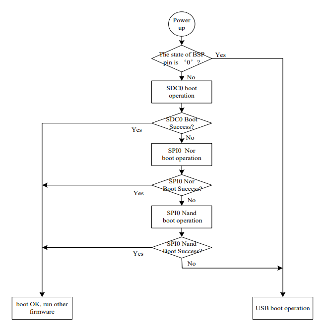

# Bootflow

## 0. 背景

V3S的datasheet里有这样一幅图：



这张图实际上描述了V3S的bootrom的大体工作流程，那么，我们应该如何使用该流程来启动我们的代码甚至Linux呢？更近一步的话，我们是否能对bootrom进行更详细的分析呢？

本文参考资料：

> [https://doc.funkey-project.com/developer_guide/software_reference/boot_process/boot_rom/](https://doc.funkey-project.com/developer_guide/software_reference/boot_process/boot_rom/)

## 1. bootrom存储位置与导出

根据datasheet的memory map可知，bootrom在v3s中位于如下地址段：


所幸的是，这段地址没有做读保护，我们可以用xfel或者sunxi-fel直接读出bin。

本文不涉及反编译的过程，感兴趣的同学可以自行研究，这里直接给出反编译后的汇编代码：

[brom.s](https://github.com/FunKey-Project/Allwinner-V3s-BROM/blob/main/brom.s)

brom的开头，就是中断向量表，这里对ARM的中断向量表和复位机制不多赘述：

```
	;; Vector table
ffff0000:	ea000008 	b	reset	      ; reset
ffff0004:	ea000006 	b	unimplemented ; _undefined_instruction
ffff0008:	ea000005 	b	unimplemented ; _software_interrupt
ffff000c:	ea000004 	b	unimplemented ; _prefetch_abort
ffff0010:	ea000003 	b	unimplemented ; _data_abort
ffff0014:	ea000002 	b	unimplemented ; _not_used
ffff0018:	ea000011 	b	irq	      ; _irq
ffff001c:	ea000000 	b	unimplemented ; _fiq
ffff0020:	ea000013 	b	fel_setup     ; FEL

unimplemented:
ffff0024:	eafffffe 	b	unimplemented ; loop forever
```

## 2. Reset Function

```
reset:
ffff0028:	e3a00001 	mov	r0, #1
ffff002c:	e3a01000 	mov	r1, #0
ffff0030:	e3a02000 	mov	r2, #0
ffff0034:	e3a03000 	mov	r3, #0
ffff0038:	e3a04000 	mov	r4, #0
ffff003c:	e3a05000 	mov	r5, #0
ffff0040:	e3a06000 	mov	r6, #0
ffff0044:	e3a07000 	mov	r7, #0
ffff0048:	e3a08000 	mov	r8, #0
ffff004c:	e3a09000 	mov	r9, #0
ffff0050:	e3a0a000 	mov	sl, #0
ffff0054:	e3a0b000 	mov	fp, #0
ffff0058:	e3a0c000 	mov	ip, #0
ffff005c:	e3a0d000 	mov	sp, #0
ffff0060:	e59ff100 	ldr	pc, [pc, #256]	; 0xffff0168 =0xffff2c00 jump to BROM
```

机器复位后，清各个寄存器，然后进行一次跳转，跳转后的内容，是allwinner系列MPU的BOOT HEADER：

```
BROM:

	;; BROM header
ffff2c00:	ea000006 	b	start  		; jump instruction, see below
ffff2c04:	4e4f4765	.ascii	"eGON" 		; magic
ffff2c08:	4d52422e	.ascii	".BRM"
ffff2c0c:	00000020	.word	32 		; header length
ffff2c10:	30303131	.ascii	"1100"		; boot version (1.1.00)
ffff2c14:	30303131	.ascii	"1100"		; eGon version (1.1.00)
ffff2c18:	31383631	.ascii	"1681"		; platform information (V3s)
ffff2c1c:	00000000	.word	0
```

### 关于BOOT HEADER中的jump instruction

jump_instruction字段存放的是一条跳转指令：( b start )，此跳转指令被执行后，程序将跳转到Boot_file_head后面第一条指令。

ARM指令中的B指令编码如下：

+--------+---------+------------------------------+

| 31--28  | 27--24   |            23--0			     |

+--------+---------+------------------------------+

|  cond    | 1 0 1 0   |      signed_immed_24          |

+--------+---------+------------------------------+

《ARM Architecture Reference Manual》对于此指令有如下解释：

Syntax :

B{`<cond>`} `<target_address>`

`<cond>` Is the condition under which the instruction is executed. If the  `<cond>` is omitted, the AL(always, its code is 0b1110 )is used

`<target_address>` Specified the address to branch to. The branch target address is calculated by:

1. Sign-extending the 24-bit signed (wro's complement) immediate to 32 bits.
2. Shifting the result left two bits.
3. Adding to the contents of the PC, which contains the address of the branch instruction plus 8.

由此可知，此指令编码的最高8位为：0b11101010，低24位根据BOOT HREADER的大小动态生成，所以指令的组装过程如下：

( sizeof( boot_file_head_t ) + sizeof( int ) - 1 ) / sizeof( int ) 		求出文件头占用的“字”的个数

-2													减去PC预取的指令条数

& 0x00FFFFFF											求出signed-immed-24

| 0xEA000000											组装成B指令

## 3. Start Function


## 4. Boot Function
