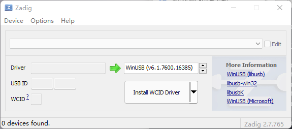

# How to enter fel mode for V3S devices

## What is fel mode ?

FEL is a low-level subroutine contained in the [BootROM](https://linux-sunxi.org/BROM "BROM") on Allwinner devices. It is used for initial programming and recovery of devices using USB.

## What is sunxi ?

**sunxi** represents the family of ARM SoCs from [Allwinner Technology](https://linux-sunxi.org/Allwinner "Allwinner"), a Chinese fabless semiconductor company. Their best known products are the **sunxi** SoC series, such as the A10 (sun4i), A13 (sun5i) and A20 (sun7i) chips, which were very successful in the low-budget tablet market. See [Allwinner SoC Family](https://linux-sunxi.org/Allwinner_SoC_Family "Allwinner SoC Family") for more information on the different Allwinner chips.

## How to enter this mode?

需要进入fel模式

1. TF卡和spi flash 同时没有可启动镜像; 也就是说你不插卡，且焊接的是新的或者没有有效镜像的spi flash，那就上电自动进入fel下载模式
2. TF卡中有进入fel模式的特殊固件 fel-sdboot.sunxi 如果你的spiflash已经有了启动镜像，那么需要在TF卡中烧入一个sunxi提供的 启动工具 （ dd if=fel-sdboot.sunxi of=/dev/mmcblk0 bs=1024 seek=8 ）， 那么插入该TF卡启动会进入fel模式；
3. 上电时SPI_MISO拉低到地 该引脚为boot引脚，上电时出于低电平即会进入fel下载模式。

## Install driver for this mode

After you first enter this mode, you should use [zadig](https://zadig.akeo.ie/) to install driver for it.

Choose your v3s device which is usually named unknown device and click the 'Install' button.

## Use sunxi-fel tool

You can find this tool in this repo.

## Use xfel tool

You can go to [xfel](https://github.com/xboot/xfel/releases) to get the newest tool.
